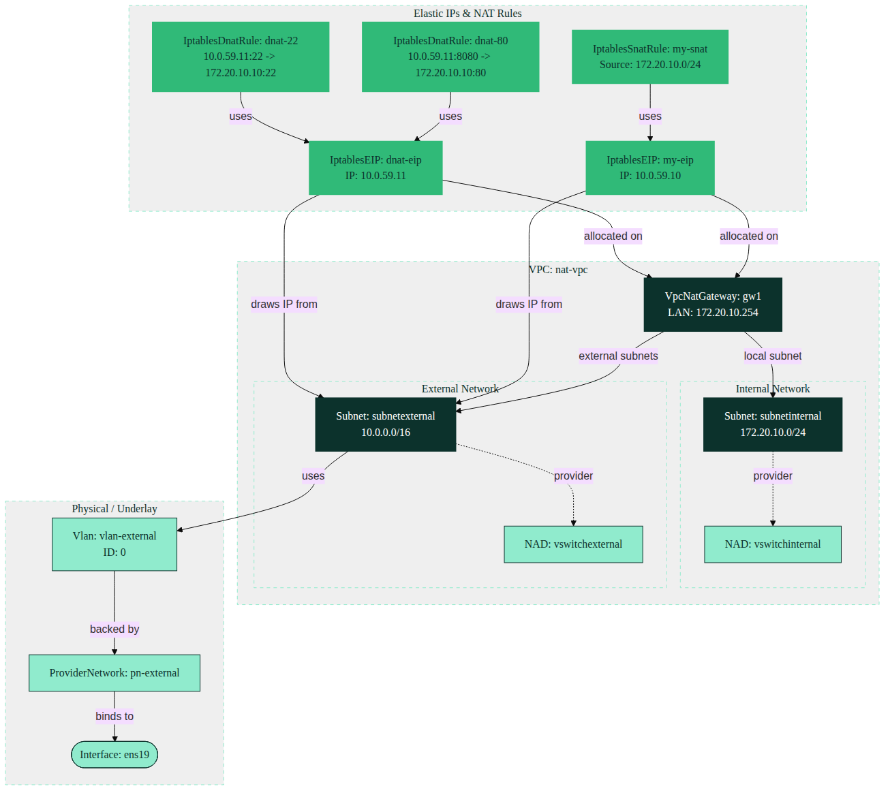

# Kube-OVN External Gateway Architecture

This document outlines the networking architecture for the Harvester/Kube-OVN setup. 

## Overview
The following architecture details how an internal network communicates with an external provider network using a VPC NAT gateway. This setup provisions SNAT for outgoing traffic and DNAT for port-forwarding specific external ports internally.



### Key Components

1. **Underlay/VLAN Configuration**: 
   Sets up a `ProviderNetwork` (`pn-external`) linked to the node's `ens19` physical interface, and maps a logical `Vlan` (`vlan-external`) over it. 
2. **Subnets & VPC**: 
   A single VPC (`nat-vpc`) isolates the logical network containing two subnets:
   * **SubnetInternal** (`172.20.10.0/24`): Dedicated for internal workloads.
   * **SubnetExternal** (`10.0.0.0/16`): The uplink to the outside world, mapped to the external VLAN setup.
   * Respective `NetworkAttachmentDefinitions` are created for workloads (Pods/VMs) to connect directly.
3. **NAT Gateway**: 
   The `gw1` VpcNatGateway bridges both internal and external subnets, maintaining a local LAN IP (`172.20.10.254`).
4. **SNAT (Source NAT)**: 
   An Elastic IP (`10.0.59.10`) bound to the Gateway provides Internet/External access for all internal traffic originating from `172.20.10.0/24`.
5. **DNAT (Destination NAT)**: 
   A secondary Elastic IP (`10.0.59.11`) maps incoming external requests into the internal network:
   * `10.0.59.11:8080` -> `172.20.10.10:80`
   * `10.0.59.11:22` -> `172.20.10.10:22`

---
*Diagram styling powered by [SUSE Mermaid Branding](https://github.com/coulof/suse-mermaid).*
## Deployment Steps

To deploy this architecture, the YAML manifests must be applied in numerical order. The numbered prefixes ensure that prerequisite resources (like the Network Attachment Definitions and the VPC) are created before the subnets, gateways, and routing rules that depend on them.

Because the files are named sequentially (`01_...` to `10_...`), you can simply apply the entire directory at once. `kubectl` processes files in alphabetical order natively:

```bash
kubectl apply -f .
```

If you prefer to apply them step-by-step to understand the flow or troubleshoot, you can do so as follows:

```bash
# 1. Base Setup (NADs & VPC)
kubectl apply -f 01_nad.yaml
kubectl apply -f 02_vpc.yaml

# 2. External Provider & VLAN
kubectl apply -f 03_provider-vlan.yaml

# 3. Subnets
kubectl apply -f 04_subnet-internal.yaml
kubectl apply -f 05_subnet_external.yaml

# 4. NAT Gateway
kubectl apply -f 06_nat-gateway.yaml

# 5. SNAT Rules (Outgoing Traffic)
kubectl apply -f 07_eip-snat.yaml
kubectl apply -f 08-iptables-snat.yaml

# 6. DNAT Rules (Port Forwarding)
kubectl apply -f 09_eip-dnat.yaml
kubectl apply -f 10_iptables-dnat.yaml
```

### Verification

Once applied, you can verify the successful creation and status of the Kube-OVN resources by querying them:

```bash
kubectl get vpc,subnet,vpcnatgateway,iptableseip,iptablessnatrule,iptablesdnatrule -A
```
