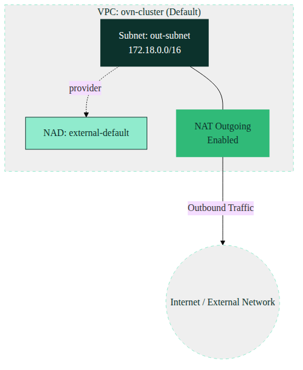

# Kube-OVN NAT Outgoing Subnet Architecture

This document outlines the networking architecture for creating a subnet with NAT Outgoing enabled in a Harvester/Kube-OVN environment.

## Overview

The architecture defines a single Subnet (`out-subnet`) within the default Kube-OVN VPC (`ovn-cluster`). The subnet has `natOutgoing` enabled, which allows workloads within this subnet to access external networks (like the internet) by translating their internal IP addresses to the external IP address of the node hosting the gateway.



### Key Components

1. **VPC (ovn-cluster)**:
   * The default VPC provided by Kube-OVN.

2. **Subnet (out-subnet)**:
   * **CIDR**: `172.18.0.0/16`
   * **Gateway**: `172.18.0.1` (Distributed)
   * **NAT Outgoing**: Enabled (`natOutgoing: true`). This provides outbound connectivity for workloads in this subnet to external networks without exposing them directly.
   * **Provider**: Uses `external-default.default.ovn` to link with the corresponding Network Attachment Definition.

3. **Network Attachment Definition (NAD)**:
   * **external-default**: Connects virtual machines/workloads to the `out-subnet` subnet.

---

## Deployment Steps

To deploy this NAT Outgoing setup, apply the YAML manifests. 

```bash
# 1. Deploy Network Attachment Definition (NAD)
kubectl apply -f nad.yaml

# 2. Deploy Subnet
kubectl apply -f subnet.yaml
```

### Verification

Once applied, you can verify the status of the subnet and ensure `natOutgoing` is set:

```bash
kubectl get subnet out-subnet -o yaml
```

*Diagram styling powered by [SUSE Mermaid Branding](https://github.com/coulof/suse-mermaid).*
