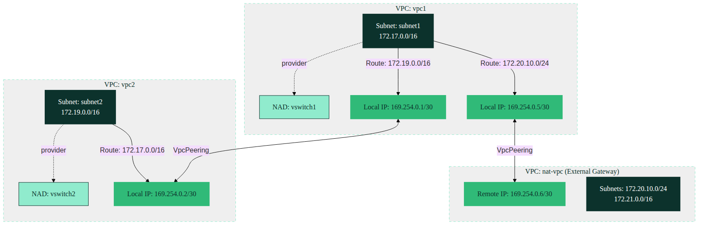

# Kube-OVN VPC Peering Architecture

This document outlines the networking architecture for establishing peering connections between isolated Virtual Private Clouds (VPCs) in a Harvester/Kube-OVN environment.

## Overview

The architecture defines two distinct VPCs (`vpc1` and `vpc2`) that are logically isolated but connected via a Kube-OVN `VpcPeering` resource. This enables cross-VPC communication without exposing internal workloads to an external network. Additionally, `vpc1` is peered with an external gateway VPC (`nat-vpc`) for outbound connectivity.



### Key Components

1. **VPC1 (172.17.0.0/16)**:
   * **Subnet1**: Houses workloads via the `vswitch1` Network Attachment Definition (NAD).
   * **Peer Connections**:
     * Maintains a peering interface (`169.254.0.1/30`) to connect to `vpc2`.
     * Maintains a second peering interface (`169.254.0.5/30`) to connect to the external `nat-vpc`.
   * **Static Routes**: Routes traffic destined for `vpc2` (`172.19.0.0/16`) and the external network (`172.20.10.0/24`, `172.21.0.0/16`) through their respective peering interfaces.

2. **VPC2 (172.19.0.0/16)**:
   * **Subnet2**: Houses workloads via the `vswitch2` NAD.
   * **Peer Connection**: Connects to `vpc1` via its local IP `169.254.0.2/30`.
   * **Static Routes**: Routes traffic destined for `vpc1` (`172.17.0.0/16`) through the peering connection.

3. **External VPC (nat-vpc)**:
   * Exists as the target for the secondary peering connection from `vpc1`, facilitating potential outbound internet access (as configured in the `external-gateway` setup).

---

## Deployment Steps

To deploy this VPC peering setup, apply the YAML manifests. It is recommended to have the `external-gateway` components (specifically the `nat-vpc`) deployed first, as `vpc1` defines a static route and peering connection dependent on it.

```bash
# 1. Ensure external dependencies (like nat-vpc) exist if following the full lab setup.

# 2. Deploy Network Attachment Definitions (NADs)
kubectl apply -f vswitch1.yaml
kubectl apply -f vswitch2.yaml

# 3. Deploy VPCs (contains Peering & Static Route configs)
kubectl apply -f vpc1.yaml
kubectl apply -f vpc2.yaml

# 4. Deploy Subnets
kubectl apply -f subnet1.yaml
kubectl apply -f subnet2.yaml
```

### Verification

Once applied, you can verify the status of the peering and subnets:

```bash
kubectl get vpc,subnet,vpcpeering -A
```

*Diagram styling powered by [SUSE Mermaid Branding](https://github.com/coulof/suse-mermaid).*